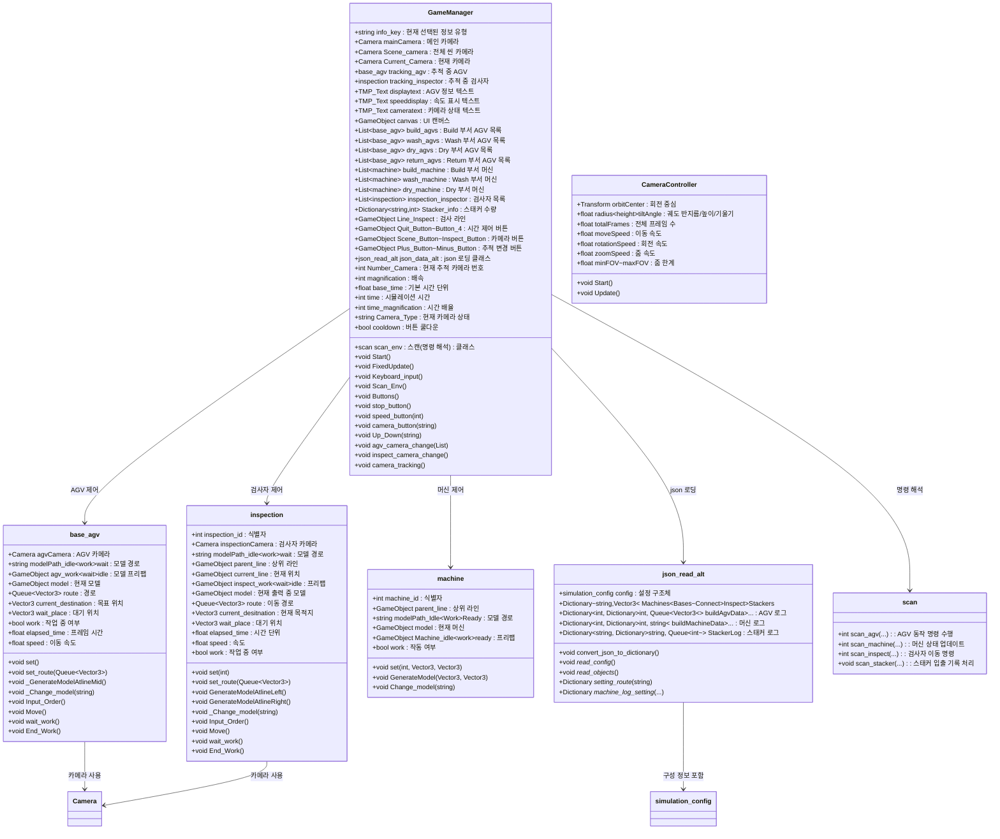
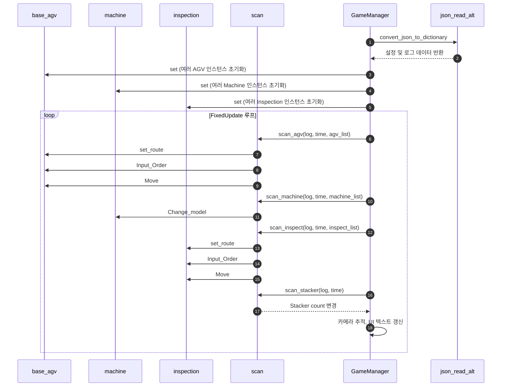
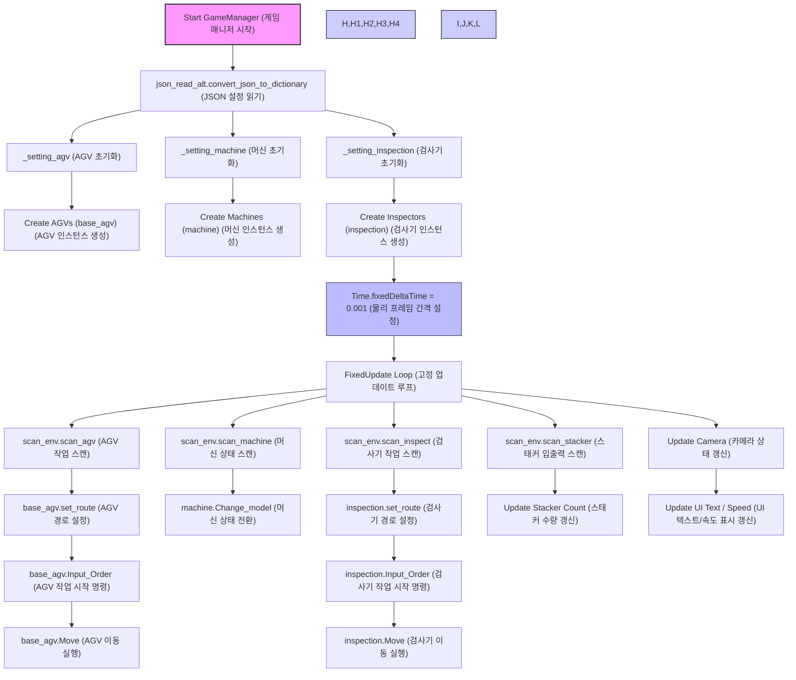

# Unity 프로젝트를 사용하는 방법

1. **Unity 라이센스를 받아서 Unity Hub를 설치**  
   - [Unity 공식 홈페이지](https://unity.com/)에서 라이센스를 신청하고 Unity Hub를 다운로드합니다.  

2. **Unity Hub에서 프로젝트를 생성**  
   - Unity Hub를 실행하고 새 프로젝트를 생성합니다.  

3. **본 repo의 unity package를 다운로드**  
   - 해당 GitHub Repository를 로컬에 클론하거나 다운로드합니다.  

4. **Unity 패키지 가져오기**  
   - `unity_project` 폴더에 있는 `Simulation_package_version1.unitypackage` 파일을 Unity 프로젝트로 드래그 앤 드롭하여 가져옵니다.  
5. **Unity Simulation만 진행 할 경우**
   - 'Unity_Simul_V1.1'만 다운로드 후 My project.exe파일을 실행
# 사용 Asset
1. banan man: https://assetstore.unity.com/packages/3d/characters/humanoids/banana-man-196830
2. Kitchen Furniture Starterpack: https://assetstore.unity.com/packages/3d/props/furniture/kitchen-furniture-starterpack-209331
3. Cartoon Wooden Box: https://assetstore.unity.com/packages/3d/props/furniture/cartoon-wooden-box-242926
4. Controllable Forklift Free: https://assetstore.unity.com/packages/3d/vehicles/controllable-forklift-free-80275

