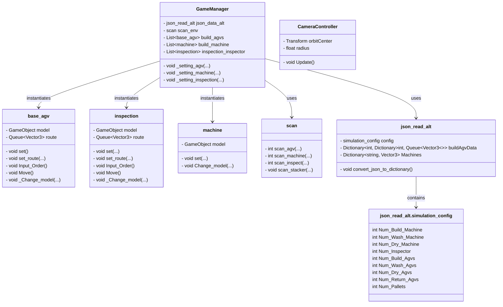
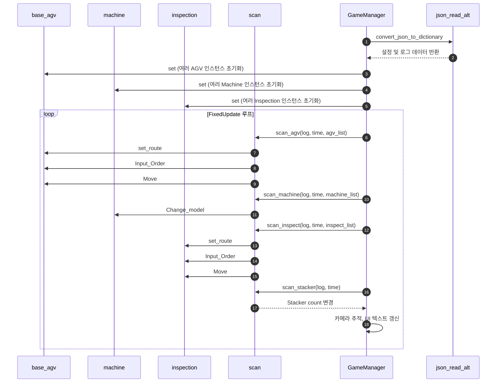

# Unity 프로젝트를 사용하는 방법

1. **Unity 라이센스를 받아서 Unity Hub를 설치**  
   - [Unity 공식 홈페이지](https://unity.com/)에서 라이센스를 신청하고 Unity Hub를 다운로드합니다.  

2. **Unity Hub에서 프로젝트를 생성**  
   - Unity Hub를 실행하고 새 프로젝트를 생성합니다.  

3. **본 repo의 unity package를 다운로드**  
   - 해당 GitHub Repository를 로컬에 클론하거나 다운로드합니다.  

4. **Unity 패키지 가져오기**  
   - `unity_project` 폴더에 있는 `Simulation_package_version1.unitypackage` 파일을 Unity 프로젝트로 드래그 앤 드롭하여 가져옵니다.  
5. **Unity Simulation만 진행 할 경우**
   - 'Unity_Simul_V1.1'만 다운로드 후 My project.exe파일을 실행
# 사용 Asset
1. banan man: https://assetstore.unity.com/packages/3d/characters/humanoids/banana-man-196830
2. Kitchen Furniture Starterpack: https://assetstore.unity.com/packages/3d/props/furniture/kitchen-furniture-starterpack-209331
3. Cartoon Wooden Box: https://assetstore.unity.com/packages/3d/props/furniture/cartoon-wooden-box-242926
4. Controllable Forklift Free: https://assetstore.unity.com/packages/3d/vehicles/controllable-forklift-free-80275




```mermaid
flowchart TD
    %% 초기화 및 설정
    A[Start GameManager] --> B[json_read_alt.convert_json_to_dictionary()]
    B --> C1[_setting_agv()]
    B --> C2[_setting_machine()]
    B --> C3[_setting_inspection()]

    C1 --> D[Create AGVs (base_agv)]
    C2 --> E[Create Machines (machine)]
    C3 --> F[Create Inspectors (inspection)]

    F --> G[Time.fixedDeltaTime = 0.001]
    G --> H[FixedUpdate Loop]

    %% FixedUpdate 내부 스캔 함수들
    H --> I[scan_env.scan_agv()]
    H --> J[scan_env.scan_machine()]
    H --> K[scan_env.scan_inspect()]
    H --> L[scan_env.scan_stacker()]

    I --> I1[base_agv.set_route()]
    I1 --> I2[base_agv.Input_Order()]
    I2 --> I3[base_agv.Move()]

    J --> J1[machine.Change_model()]

    K --> K1[inspection.set_route()]
    K1 --> K2[inspection.Input_Order()]
    K2 --> K3[inspection.Move()]

    L --> L1[Update Stacker Count]

    H --> M[Update Camera]
    M --> N[Update UI Text / Speed]

    %% 스타일 지정
    style A fill:#f9f,stroke:#333,stroke-width:2px
    style H,H1,H2,H3,H4 fill:#ccf,stroke:#000
    style I,J,K,L fill:#ccf,stroke:#000
    style G fill:#bbf,stroke:#333,stroke-width:1px
```
```mermaid
flowchart TD
    %% 초기화 및 설정
    A[Start GameManager] --> B[json_read_alt.convert_json_to_dictionary()]
    B --> C1[_setting_agv()]
    B --> C2[_setting_machine()]
    B --> C3[_setting_inspection()]

    C1 --> D[Create AGVs (base_agv)]
    C2 --> E[Create Machines (machine)]
    C3 --> F[Create Inspectors (inspection)]

    F --> G[Time.fixedDeltaTime = 0.001]
    G --> H[FixedUpdate Loop]

    %% FixedUpdate 내부 스캔 함수들
    H --> I[scan_env.scan_agv()]
    H --> J[scan_env.scan_machine()]
    H --> K[scan_env.scan_inspect()]
    H --> L[scan_env.scan_stacker()]

    I --> I1[base_agv.set_route()]
    I1 --> I2[base_agv.Input_Order()]
    I2 --> I3[base_agv.Move()]

    J --> J1[machine.Change_model()]

    K --> K1[inspection.set_route()]
    K1 --> K2[inspection.Input_Order()]
    K2 --> K3[inspection.Move()]

    L --> L1[Update Stacker Count]

    H --> M[Update Camera]
    M --> N[Update UI Text / Speed]

    %% 스타일 지정
    style A fill:#f9f,stroke:#333,stroke-width:2px
    style H,H1,H2,H3,H4 fill:#ccf,stroke:#000
    style I,J,K,L fill:#ccf,stroke:#000
    style G fill:#bbf,stroke:#333,stroke-width:1px
```


